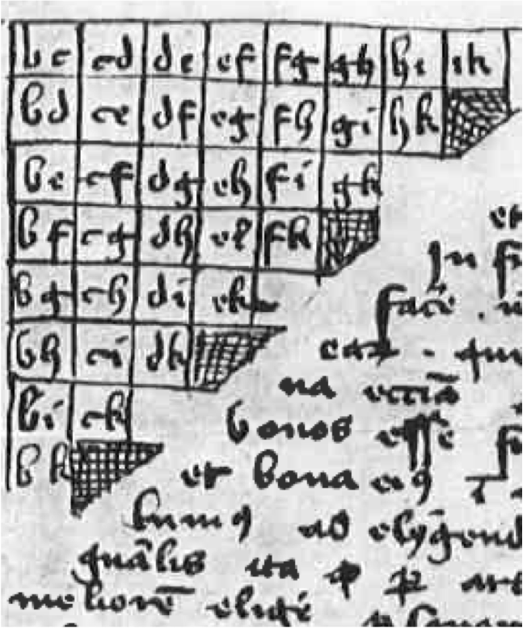

---
#----ESSENTIALS----#
title: "\\huge \\textbf{\\textit{Scissors beats Rock} \\Large \\&  other failures of Transitive Models using Paired Comparisons}"
author: "\\contour{black}{\\textbf{Ryan P. A. McShane, Ph.D.}}"
affiliation: "Former Visiting Assistant Professor of Statistics, Amherst College $\\;$ \\faTwitter  \\quad   \\@$\\text {\\underline{math\\_mcshane}}$ $\\;$ \\faGithub \\quad \\@$\\text{\\underline{math-mcshane}}$ $\\;$ \\vspace{-5mm}{\\includegraphics[width = 25pt]{images/Circular Triad.png}} \\quad $\\text{\\underline{ryanmcshane.com}}$"
font_family: "palatino" # choose from typical latex fonts (example: "palatino")

#----COLORS (Everything in hex)----#

#Background/ Line colors
titlebox_bgcol: "311a4d" # Background color of title box
titlebox_bordercol: "777777" # Line around title box
body_bgcol: "FFFFFF" # Color behind main body of poster
sectitle_bgcol: "5D3C85" # Color of section titles
sectitle_bordercol: "111111" # Line color around section title boxes
columnline_col: "000000" #color of line between columns

#Text colors
title_textcol: "FFFFFF" #color of title text
author_textcol: "ffffff" # Color of author text
affiliation_textcol: "FFFFFF" # Color of affiliation text
body_textcol: "000000" # Color of main text in the body of poster
header_textcol: "690F8C" # Color of the poster header titles
sectitle_textcol: "FFFFFF" # Color of text in section titles
footnote_textcol: "000000" # Color of footnote text if used
cite_col: "005500" #color of ciation elements
url_col: "002c6b" #color of url links
link_col: "002c6b" #color of other links within the poster

#----TEXT SIZES----#
font_size: "30pt" #sets '\normalsize' (sizes of the title and sections headings will adjust based on it)
sectitle_textsize: "large" # Change the font size of the section titles
body_textsize: "normalsize" # Change the font size of your body
bibliography_textsize: "scriptsize" # Change the font size of the bibliography
title_textsize: "normalsize" # Title text size
author_textsize: "LARGE" # Author text size
affiliation_textsize: "normalsize" # Affiliation text size


#----POSTER SIZE & COLUMN FORMATTING----#
poster_height: "24in" # height in inches of poster
poster_width: "36in" # width in inches of poster
column_numbers: 3 # Number of columns that the poster has
column_margins: "18mm" # Margin spacing for columns
columnline_width: "2pt" # Width of line separating columns
titlebox_shape: "all" # The box shape around the title (options from `tcolorbox`)
titlebox_borderwidth: "4pt" # Line thickness around title
sectitle_borderwidth: "2pt" # Line thickness on title 
sectitle_boxshape: "uphill" # Shape of section title box (from `tcolorbox`)
ulmargin_size: "0pt" # Margin at bottom of poster
lrmargin_size: "0pt" # Margin on left and right of poster


#----LOGO----#
logoleft_name: "logo/AmherstCollege-Seal_WhiteRGB.pdf"
logoleft_width: "2.8in"
logoleft_xshift: ".55in"
logoleft_yshift: ".55in"
logoright_name: "logo/AmherstCollege-Seal_WhiteRGB.pdf"
logoright_width: "2.8in"
logoright_xshift: "-.55in"
logoright_yshift: ".55in"

#----OTHER----#
bibliography: references # name of the .bib file used for referencing
output: 
  posterdownLaTeX::posterdown_latex: 
    pandoc_args: "--highlight-style=knit-files/mcshanepdf.theme"
    latex_engine: lualatex        # Only needed for custom fonts
csl: knit-files/ASA-McShane.csl

header-includes: 
 - \usepackage[outline]{contour}
 - \definecolor{citegreen}{HTML}{005500}
 - \definecolor{codegray}{HTML}{f9f9f9}
 - \definecolor{codeletter}{HTML}{002c6b}
 - \let\textttOrig\texttt
 - \renewcommand{\texttt}[1]{\textttOrig{\textbf{\textcolor{codeletter}{\colorbox{codegray}{#1}}}}}
 - \usepackage{fontspec, bm, fontawesome5}
 - \setmainfont{Jost-Regular}[Extension=.ttf,BoldFont=Jost-Bold,ItalicFont=Jost-Italic,BoldItalicFont=Jost-BoldItalic]
---

```{r, include=FALSE}
knitr::opts_chunk$set(echo = FALSE, results = 'asis',fig.height = 3.5, fig.width = 4.5, out.width = "100%", warning = FALSE, fig.align = 'center', message = FALSE, dev='cairo_pdf')
library(readr)
library(kableExtra)
```


\vspace{-2mm}

\begin{minipage}[]{.85\columnwidth}

\footnotesize
This poster was created using my revived version of the \texttt{posterdownLaTeX} \texttt{R} package. The code needed to produce this poster can be found at

\textbf{github.com/math-mcshane/IMS-NRC-2022-Poster-and-Presentation}

\end{minipage}
\hfill \hfill
\begin{minipage}{.125\columnwidth}

\raisebox{-.4\height}{\includegraphics[clip=true,width = 4cm]{Figures/GitHubQR}}

\end{minipage}

\vspace{-7mm}

# Abstract

\normalsize

If the Utah Jazz beat the Portland Trailblazers and the Trailblazers beat the Denver Nuggets, does that mean that the Jazz are better than the Nuggets, or could the Nuggets actually be better than the Jazz? To answer this question, we investigate the assumption of transitivity. We propose a novel linear model (CRSP) whose latent bilinear fixed effect allows us to estimate deviations from our transitive model (C). Additionally, we consider extensions. 

\vspace{-2mm}

# Paired Comparisons and (In)transitivity

\begin{minipage}[]{.75\columnwidth}

Classically \cite{Thu1927} $n$ objects are compared [teams compete] one pair at a time, until all $n \choose 2$ comparisons are made. Then, object [team] ratings are derived and subsequently ranks. First documented in 1283 to select a pope \cite{Llu1283}. $\;\;\;\mathbf{\xrightarrow{\hspace{2.5cm}}}$

\end{minipage}
\hfill \hfill
\begin{minipage}{.215\columnwidth}

\vspace{15pt}
```{r, out.width="90%"}

```
\vspace{1pt}

\end{minipage}

\vspace{2pt}

\begin{figure}

\textbf{Transitive Property of Inequality}: Let $a, b, c$ be real numbers (team ratings). If $a > b$ and $b > c$, then $a > c$.

\textbf{Weak Stochastic Transitivity Property}: Let $A, B, C$ be teams. If $P(A \rightarrow B)$, $P(B \rightarrow C) > 0.5$, then $P(A \rightarrow C) > 0.5.$

\vspace{-3mm}

```{r, out.width="100%"}

```

\vspace{-11mm}

Every common paired comparisons model (Bradley-Terry, Elo, Glicko, Trueskill, etc) assumes at least the WST Property \cite{McShane2019Intransitive}. 

\vspace{7mm}

We introduce a model (CRSP) that does allow intransitivity. For the following, assume that a double round robin has been observed -- all teams $i$ play all teams $j$, $i \neq j$, $n_{ij} = n_{ji} = 1$ times.


\end{figure}

\columnbreak

# Chain Model (Transitive)

We want to model $Y_{ij}$, the score of home team $i$ minus the score of away team $j$. We consider several models of the form $Y_{ij} = \mu_{ij} +\varepsilon_{ij}$, where $\varepsilon_{ij}$ independent and $\sigma_{\varepsilon}$ constant. The first is the \textbf{Chain model} with fixed effect strength parameters $\alpha_i$ for team $i$ and home effect $h$, for the expected score differential $\mu_{ij}$ when team $i$ hosts team $j$: 

\vspace{-10pt}

\begin{figure}

$$\mu_{ij} = h + \alpha_i - \alpha_j.$$

\vspace{-10pt}

Finding solutions for $\hat h$ and $\boldsymbol{\hat\alpha}$ is straight forward:

\vspace{-30pt}

$$\hat{h} = ({\sqrt{2}n})^{-2}\boldsymbol{1}^T(\boldsymbol{Y} - \boldsymbol{Y}^T)\boldsymbol{1} = \bar{y}_{..},$$

\vspace{-50pt}

$$\hat{\alpha}_i = 2^{-1}(\bar{y}_{i.} - \bar{y}_{.i}) \Rightarrow \boldsymbol{\hat{\alpha}} = (2n)^{-1} \big[\boldsymbol{Y} - \boldsymbol{Y}^T \big] \boldsymbol{1}.$$
\end{figure}
\vspace{-35pt}


# CRSP (Chain Rock-Scissors-Paper) Model

We can make the $\mu_{ij}$ intransitive by including a fixed interaction effect $\beta_{ij}$, where $\beta_{ij} = -\beta_{ji}$ and $\Sigma_j \beta_{ij} = 0 \; \forall i$ (this will overfit when $n_{ij}$ small):

\begin{figure}

\vspace{-25pt}

$$\mu_{ij} = h + \alpha_i - \alpha_j + \beta_{ij}$$


\vspace{-15pt}

\begin{minipage}[]{.79\columnwidth}

We instead introduce the notion of circular triads, $\boldsymbol{T}$, from \cite{KendallSmith1940}: 
\vspace{-55pt}
$$\boldsymbol{T} = \left[ \begin{array}{rrr}
0 & 1 & -1\\
-1 & 0 & 1\\
1 & -1 & 0
\end{array}\right].$$

\end{minipage}
\hfill \hfill
\begin{minipage}{.20\columnwidth}

\vspace{8pt}
```{r, out.width="100%"}

```
\end{minipage}

We propose an alternative to $\beta_{ij}$, $f(\boldsymbol{\beta}_i, \boldsymbol{\beta}_j)$, with $\boldsymbol{\beta}_i = \big[r_i \; \; \; s_i \; \; \; p_i\big]$ and let $r_i + s_i + p_i = 0$,
\vspace{-30pt}

$$f(\boldsymbol{\beta}_i, \boldsymbol{\beta}_j) = \boldsymbol{\beta}_i^T\boldsymbol{T\beta}_j \propto r_is_j - s_ir_j.$$

\vspace{-10pt}

This gives us our \textbf{CRSP model} with $\boldsymbol{r}, \boldsymbol{s}$ orthogonal 

\vspace{-30pt}

$$\mu_{ij} = h + \alpha_i - \alpha_j + r_is_j - r_js_i.$$

\vspace{-10pt}

Extension: \textbf{Generalized CRSP model}, $K \in \{ 0, 1, ..., \big[ \frac{n-1}{2} \big] \}$:

\vspace{-30pt}

$$\mu_{ij} = h + \alpha_i - \alpha_j + \Sigma_{k= 1}^K r_{ik}s_{jk} - s_{ik}r_{jk}.$$

\vspace{-10pt}

Finding solution to $\bm{\hat r, \hat s}$, where $\bm{C}$ is the residual matrix: 

\vspace{-55pt}

$$\boldsymbol{C} = 2^{-1}(\boldsymbol{Y} - \boldsymbol{Y}^T) - (\bm{\hat \alpha 1}^T - (\bm{\hat \alpha 1}^T)^T) = \Sigma_{k=1}^K \bm{r}_k\bm{s}_k^T - \bm{s}_k\bm{r}_k^T.$$

\vspace{-25pt}

$\bm{r}_k$ and $\bm{s}_k$ are the eigenvectors of $\bm C \bm C^T$. The $\bm r_k, \bm s_k$ with the largest eigenvalue pair are the solutions to the CRSP model, second largest eigenvalues to the second intransitive vector pair in generalized CRSP, etc. See Ch. 4 of \cite{McShane2019Intransitive} for more details.  

\end{figure}

<!-- \vfill\null -->
\columnbreak

# Chain and CRSP Example (2017 NBA Data)

We use all data from the 2016-2017 NBA season, where repeated games are averaged. We estimate $\hat{h} = 2.89, \; \hat{\alpha}_{GSW} = 11.27, \hat{\alpha}_{SAS} = 7.91, \; \hat{\alpha}_{HOU} = 4.93, \; \hat{\alpha}_{LAC} = 4.33, ...$. Displayed are the relative differences of team strengths, $\alpha_i - \alpha_j$. 


\begin{figure}


```{r, out.width="90%"}

```

\vspace{-45pt}

This is the chain model. Note that $\hat{\alpha}_{GSW} - \hat{\alpha}_{HOU} = ( \hat{\alpha}_{GSW} - \hat{\alpha}_{SAS}) + (\hat{\alpha}_{SAS} - \hat{\alpha}_{HOU}) = 6.34$. Now, we take the residuals, $\bm{C}$, and find the eigendecomposition of $\bm{CC}^T$. We get, for example, $\hat r_{GSW} = -3.40, \hat r_{SAS} = 0.86, \hat s_{GSW} = 0.29, \hat s_{SAS} = 1.10$. Then, if $h = 0$, $\hat \mu_{SAS,GSW} = \hat \alpha_{SAS} - \hat \alpha_{GSW} + \hat r_{SAS}\hat s_{GSW} - \hat r_{GSW}\hat s_{SAS} = 0.62$. 


\vspace{-30pt}

```{r, out.width="90%"}

```


\end{figure}

\vspace{-50pt}


# Ongoing Work

\textrm{1. EM Algorithm for incomplete cases, 2. How to pick $K$ in Generalized CRSP, 3. Weights $\omega_{ijh}$ for game $h$ b/w $i$ and $j$, 4. Clustering players and line-ups, use CRSP at line-up level, and identify team-level intransitivity causes. 5. Smash N64 application -- player $\gamma_\ell$, character $\alpha_i, r_is_j - r_js_i$. 6. Possible digraphs.} 


<!--- This prints the bibliography and affiliations as a single floating figure to allow for appropriate vertical spacing -->
\vspace{10pt}
\begin{figure}
\printbibliography
\end{figure}
\vspace{-60pt}

<!--- Add the footnote and the QR code to the GitHub repo, with the raisebox argument adjusting the image vertical centering -->
<!-- \footnote{\newline This poster was created using my revived version of the `posterdownLaTeX` package. The code needed to produce this poster can be found at \textbf{github.com/math-mcshane/IMS-NRC-2022-Poster-and-Presentation}\raisebox{-.4\height}{\includegraphics[clip=true,width = 4cm]{Figures/GitHubQR}}} -->


